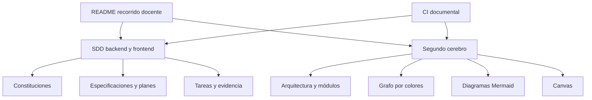

# Arquitectura de la entrega documental

```mermaid
flowchart TD
  R[README recorrido docente] --> S[SDD backend y frontend]
  R --> K[Segundo cerebro]
  S --> C[Constituciones]
  S --> P[Especificaciones y planes]
  S --> T[Tareas y evidencia]
  K --> A[Arquitectura y módulos]
  K --> G[Grafo por colores]
  K --> M[Diagramas Mermaid]
  K --> V[Canvas]
  I[CI documental] --> S
  I --> K
```

Esta arquitectura describe documentación y navegación, no nuevos microservicios. El código enlazado conserva sus propias fronteras y validaciones.
